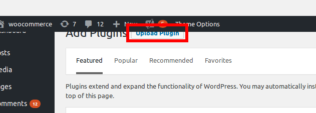
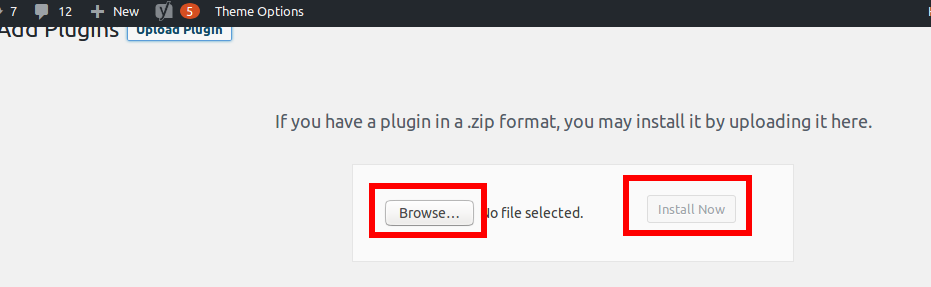
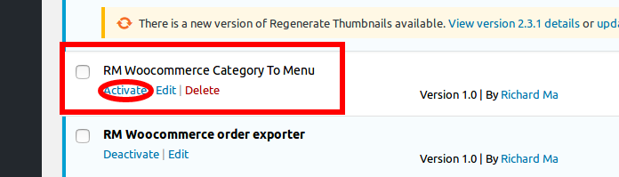
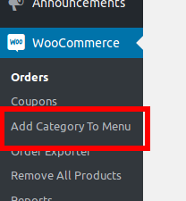

# RM Woocommerce Category To Menu

## Plugin Info
* Author: Richard Ma
* Tags: woocommerce, ecommerce, e-commerce, store, sales, sell, shop, menu, category
* Requires at least: 4.4
* Tested up to: 4.8
* Stable tag: 1.0
* License: MIT

## 安装

* 管理后台 > Plugins > Add New > Upload Plugin

* 选择本插件的安装包上传

* 管理后台 > Plugins > Installed Plugins > RM Woocommerce Category To Menu > Activate 启用插件

## 使用
* 管理后台 > WooCommerce > Add Category To Menu

* 出现Done字样则表示WooCommerce后台所有分类导入导航菜单成功
* 管理后台 > Appearance > Menus查看导入结果
